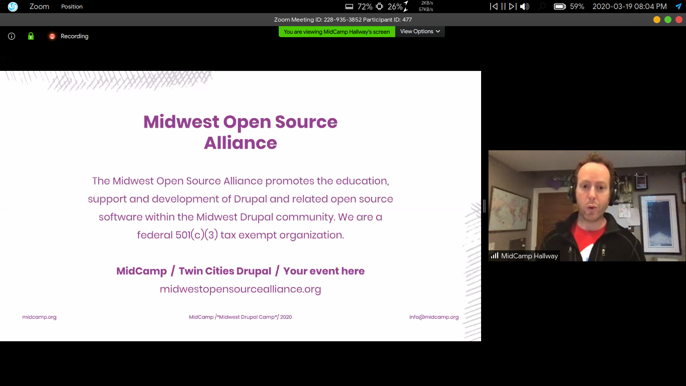

## "WHO" Defines: 
**Coronavirus disease (COVID-19) is an infectious disease caused by a newly discovered coronavirus.**
**Most people infected with the COVID-19 virus will experience mild to moderate respiratory illness and recover without requiring special treatment.  Older people, and those **with underlying medical problems like cardiovascular disease, diabetes, chronic respiratory disease, and cancer are more likely to develop serious illness.**

It was early March; I was quite excited about the VISA. Every puzzle piece was in place for me to visit the US for flink-forward, San Fransisco and Drupal Mid-Camp.
I received these emails in 5-6 days regarding the Cancellation of the conferences because of the outbreak of coronavirus.

 

I was pissed off as they were my first international conferences. But yes, looking at the bigger picture, It was the right decision as the Virus is spreading at a tremendous rate. At the time of writing this article, there were more than 80,000 cases in china and respectively, and cases in Italy are uncontrollable.
India has been in  LockDown for the past 3-4 days. If I had gone to the conference, most likely, I had been stuck there for the next 2-3 months.

Lack of testing facilities been a significant cause of the spread because symptoms take about 14 days to show up, and meanwhile, unknowingly its gets transmitted from individual to individual.

It looks like Virus is here to stay . Everyone is trying to adapt to this new way of living, All Tech Companies are operating remotely, and Work From Home has become the new general.

MeanWhile, there was a silver lining for me, Both of my conferences got converted into virtual events. 
Recently I attended the mid-camp event conducted via **zoom**. It was quite an experience for me; Organisers tried their best to recreate the experience.
Speakers were available in the slack channels for queries after their session. The whole Online Event was well managed, hats off to the entire team.
It also has a virtual game night and movie night as extra activities.
I attach some screenshots of the events down here.

Overall it was an excellent experience for me, but not as good as the onsite event, which was about to happen. 
With respect to COVID-19, keep yourself isolated, and regularly wash your hand.